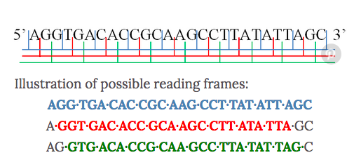

<!-- @import "[TOC]" {cmd="toc" depthFrom=1 depthTo=6 orderedList=true} -->

* [Into the rabbit hole](Into-the-rabbit-hole)
* [When Long Non-Coding Becomes Protein Coding](#When-long-non-coding-becomes-protein-coding)
    * [Notes](#notes)
* [Many lncRNAs 5UTRs and pseudogenes are translated and some are likely to express functional proteins](#Many-lncrnas-5utrs-and-pseudogenes-are-translated-and-some-are-likely-to-express-functional-proteins)

# Into the rabbit hole

List of papers that might be useful:
1. 2017 review: Classification and function of small open reading frames 
1. On Ribosome Profiling: Genome-Wide Analysis in Vivo of Translation with Nucleotide Resolution Using Ribosome Profiling [here](https://science.sciencemag.org/content/324/5924/218)
1. On ribosome Profiling: Ribosome profiling of mouse embryonic stem cells reveals the complexity and dynamics of mammalian proteomes [here](https://www.cell.com/fulltext/S0092-8674%2811%2901192-5)
[here](https://www.nature.com/articles/nrm.2017.58)
1. random non-related interesting read: [here](https://www.ncbi.nlm.nih.gov/pmc/articles/PMC1448817/)

# When Long Non-Coding Becomes Protein Coding

[paper here](https://mcb.asm.org/content/mcb/40/6/e00528-19.full.pdf)

Some putative (=supposed, accepted) ncRNAs have been misannotated as non-coding; they actually contain small ORFs and these code for micro-peptides/small proteins.

- Less than 2% of the human genome is annotated as protein-coding.
- Traditional criteria of what makes an ORF: Has 100 amino acids in eukaryotes and 50 amino acids in bacteria.
- This arbitrary criteria excludes lot of ncRNAs that contain ORFs smaller than traditional cut-off. But there's growing evidence that ncRNAs produce biologically relevant micro-peptides (shown across species: humans, flies, bacteria).
- Especially true for  lncRNAs, ncRNAs which are longer than ~200 nts. Like mRNAs, ncRNAs are transcribed by RNApolII, and (often) undergo 5'-capping, polyadenylation and splicing. lncRNAs localize in the _nucleus_ (functions: 'control transcription (e.g., chromatin remodeling or functioning as enhancer RNA), regulate pre-mRNA splicing, and act as scaffolds for the formation of protein complexes and subnuclear domains') or in the _cytoplasm_ (where they can be potentially translated into micro-peptides).

<u>This review</u>: Approaches used to study coding potential of ncRNAs.

---

## Techniques 

1. _Ribosome profiling_ 
    - Principle: actively translating ribosomes can protect ~30nt long RNA segments from nuclease digestion. (The fragments protected by the ribosomes are called 'ribosome footprints' _what an obtuse name! though it does sound impressive_)
    - Using this, you can study changes in translation in response to different conditions. 
    - Someone invented GTI-seq (global translation initiation) to improve upon this.
    - But just because some RNA is associated with ribosome is not mean it is actively being translated.
1. An SVM based classifier that shows lncRNAs and pseudogene RNAs are translated.
    - Many lncRNAs, 5’UTRs, and pseudogenes are translated and some are likely to express functional proteins [here](https://elifesciences.org/articles/08890)

1. Ribosome release score (RRS): metric designed to differentiate between coding and non-coding transcripts. 
    - Based on the principle that coding transcripts will be released from the ribosome when the stop codon is reached. 
    - People used this to argue that non-coding transcripts are not translated. [Eric Lander as PI](https://www.sciencedirect.com/science/article/pii/S0092867413007113#!).
    - Other people have counter argued using the same technique. [here](https://link.springer.com/article/10.1186/s12864-016-2384-0)

1. Developed Ribo-seq [here](https://elifesciences.org/articles/03528)
    - Principle: multiple ribosomes bind to the same RNA transcript during translation and form _polysomes_.
    - identified 2 classes of sORFs
        1. Class 1: long ORFs, 80aa long micro-peptides, frequently translated, conserved between species.
        2. Class 2: small ORFs, 10 aa long micro-peptides, not translated as frequently, not conserved between species.

## Notes

- [Reading frames](https://www.wikiwand.com/en/Reading_frame): Divide a nucleic acid (RNA/DNA) into consecutive triplets. A DNA molecule has 6 possible reading frames (3 on each strand), RNA has 3.

- _Open reading frame_: a reading frame with the ability to be translated into protein. Starts with a _start codon (AUG==ATG)_ and ends with a stop codon (UAA, UAG, UGA)

- _Start codon_: first codon of an mRNA molecule that is translated by the ribosome. Codes for methionine in eukaryotes and archaea and for modified methionine in bacteria, plastids, mitochondria.
    - Alternate start codons are still translated as methionine, because a separate tRNA is used for translation initiation.
    - Alternate start codons non-AUG are rare in eukaryotes, but have been reported. 
    - Prokaryotes frequently use non-AUG alternate start codons.

# Many lncRNAs 5UTRs and pseudogenes are translated and some are likely to express functional proteins

_Elife papers are so nicely written! Simple and beautiful and easy to understand!_

Copied from paper: 
1. <u>What they've done</u>: _we develop a method, RibORF, to analyze ribosomal profiling data and identify translated ORFs_
1. <u>How they've done it</u>: _that combines alignment of ribosomal A-sites, 3-nt periodicity, and uniformity across codons._
1. <u>Use</u>: _RibORF can effectively distinguish in-frame ORFs from overlapping off-frame ORFs,_
1. <u>Use</u>:  _and it can distinguish reads arising from RNAs that are not associated with ribosomes._
1. <u>Results</u>:  _Using RibORF, we identify thousands of translated ORFs in lncRNAs, pseudogenes, and mRNA regions upstream (5’UTRs) and downstream (3’UTRs) of protein-coding sequences._
1. <u>Importance</u>:  _Our results suggest that cytoplasmic noncoding RNAs are translated, and that some of these translated products are likely to be biologically meaningful based on their evolutionary conservation._

## Introduction

- There are RNA transcripts other than mRNA that are generated by RNA polymerase II, are adenylated, capped and spliced. But may not code for proteins. Biological functions of most lncRNAs remain unknown. 
    - There are examples of micropeptodes from lncRNAs that have biological functions.

- Psudogenes: homologous to protein-coding genes, but have lost coding ability/are not expressed.
    - Regulation role: compete with mRNA for microRNAs (competing endogenous RNAs)
    - Some are DE in cancers
    - Unknown if RNAs expressed from pseudogenes have any functions.

- uORFs: In the 5' untranslated regions there may exist an ORF (upstream of the protein-coding ORF)
    - Since ribosomes scan the transcript from 5' -> 3', uORFs have potential to regulate primary ORF

