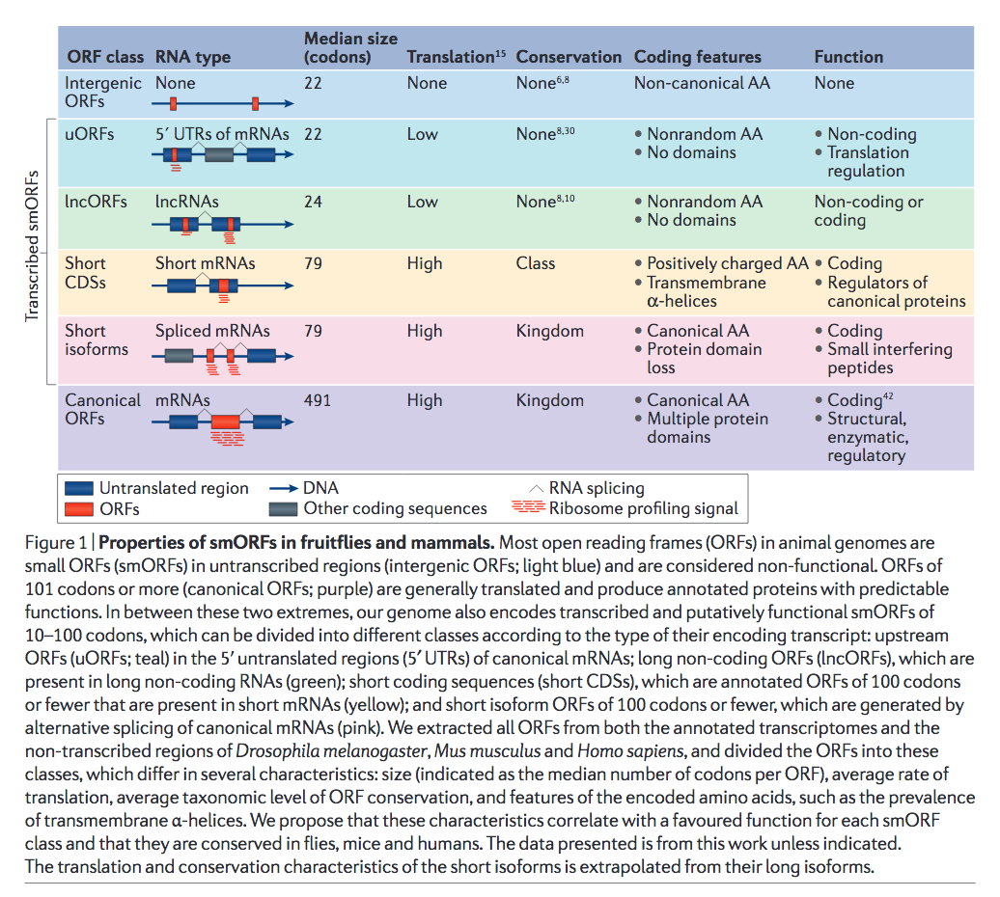

1. Nature machine intelligence, May 2109. 
    - [Evaluation of deep learning in non-coding RNA classification](https://www.nature.com/articles/s42256-019-0051-2) 
    - [code and data available](http://homepage.cs.latrobe.edu.au/ypchen/ncRNAanalysis/)

1. Bioinformatics, March 2020
    - DeepCPP: a deep neural network based on nucleotide bias information and minimum distribution similarity feature selection for RNA coding potential prediction [paper](https://academic.oup.com/bib/advance-article/doi/10.1093/bib/bbaa039/5813257)
    - [Code and data](https://github.com/yuuuuzhang/DeepCPP) 

---
# Reading list:
1. The hunt for sORFs: A multidisciplinary strategy, experimental cell research 2020 [h](https://www.sciencedirect.com/science/article/pii/S0014482720301282)
    - 2020 review!
1. Accurate annotation of human protein-coding small open reading frames, Nature chemical biology, 2019, [h](https://www.nature.com/articles/s41589-019-0425-0)
    - Promises to be a fulfilling read! Will likely disappoint because I'll want to have done this before them!
1. MiPepid: MicroPeptide identification tool using machine learning, Bioinformatics 2019, [h](https://link.springer.com/article/10.1186/s12859-019-3033-9)
    - AAAAH! There goes another idea! Uses the sequences to predict the micropeptides!
    - _We trained MiPepid using carefully cleaned data from existing databases and used logistic regression with 4-mer features. With only the sequence information of an ORF, MiPepid is able to predict whether it encodes a micropeptide with 96% accuracy on a blind dataset of high-confidence micropeptides, and to correctly classify newly discovered micropeptides not included in either the training or the blind test data._
1. Peptides encoded by noncoding genes: challenges and perspectives, signal transduction & trageted therapy, 2019 [h](https://www.nature.com/articles/s41392-019-0092-3)
    - _a critical review is presented on the action modes and biological functions of the peptides encoded by NCGs. The challenges and future trends in searching for and studying NCG peptides are also critically discussed._
1. MiTPeptideDB: a proteogenomic resource for the discovery of novel peptides, Bioinformatics 2020 [h](https://academic.oup.com/bioinformatics/article/36/1/205/5523846)
1. The functions and unique features of long intergenic non-coding RNA, Nature, 2018, [h](https://www.nature.com/articles/nrm.2017.104)
    - review
1. Translation of Small Open Reading Frames: Roles in Regulation and Evolutionary Innovation, Trends in genetics, 2019, [h](https://www.sciencedirect.com/science/article/pii/S0168952518302221)
1. Viral Infection Identifies Micropeptides Differentially Regulated in smORF-Containing lncRNAs, genes 2017, [h](https://www.mdpi.com/2073-4425/8/8/206)
1. Mining for Small Translated ORFs, proteome research 2017, [h](https://pubs.acs.org/doi/abs/10.1021/acs.jproteome.7b00707)
    - review
1. Alternative ORFs and small ORFs: shedding light on the dark proteome, nucleic acids recearch, 2020 [h](https://academic.oup.com/nar/article/48/3/1029/5556081)
    - review!!!!!!
1. Many lncRNAs, 5′UTRs, and pseudogenes are translated and some are likely to express functional proteins. eLife 2015
    - Read about riboORF and how it works. SVM to classify orfs?
---
# 2019

1. Accurate annotation of human protein-coding small open reading frames, Nature chemical biology, 2019, [h](https://www.nature.com/articles/s41589-019-0425-0)
    - Promises to be a fulfilling read! Will likely disappoint because I'll want to have done this before them!
---
# 2018

1. FSPP: A Tool for Genome-Wide Prediction of smORF-Encoded Peptides and Their Functions, Frontiers in Genetics, 2018 [h](https://www.frontiersin.org/articles/10.3389/fgene.2018.00096/full?report=reader)
    - 
    - _Tested on 38 sequenced samples of 5 human cell lines, FSPP successfully predicted 856 out of 960 annotated proteins. Interestingly, FSPP also highlighted 568 functional SEPs from these samples. After comparison, the roles predicted by FSPP were consistent with known functions_

1. 

---
# 2017

1. Mining for Micro-peptides: Review, Trends in Cell Biology, __2017__ [paper](https://www.sciencedirect.com/science/article/pii/S0962892417300648)
    - Already done everything? And better? Cites a bunch of relevant stuff.

    - PhyloCSF: identify potential coding genes based on the evolutionary conservation of their nucleotide sequence. [2011 paper here](https://academic.oup.com/bioinformatics/article/27/13/i275/178183) & [2015 paper here](https://link.springer.com/article/10.1186/s13059-015-0742-x).

    

    - Use this ribo-seq graphic in final presentation
    

    - Eliminate technical noise in ribo-seq data using other features like 
        - length 
        - tri-nucleotide periodicity, 
        - positioning of the ORF within a transcript,
        - responsiveness to translation inhibitors
        - relevant [2015 nature: Detecting actively translated open reading frames in ribosome profiling data](https://www.nature.com/articles/nmeth.3688)
        - relevant [2016 elife: Thousands of novel translated open reading frames in humans inferred by ribosome footprint profiling](https://elifesciences.org/articles/13328)

        - several excellent algorithms and metrics have been developed to help analyze and process ribosome profiling data to recognize and identify regions of translation, including [FLOSS](https://www.sciencedirect.com/science/article/pii/S2211124714006299), [ORF score](https://www.embopress.org/doi/abs/10.1002/embj.201488411), [PROTEOFORMER](https://academic.oup.com/nar/article-abstract/43/5/e29/2453155), and [ORF-RATER](https://www.sciencedirect.com/science/article/pii/S1097276515009053).

        - databases to collect ribo-seq data and genome annotations from this data
            - [TISdb](https://academic.oup.com/nar/article-abstract/42/D1/D845/1048773)
            - [GWIPS-viz](https://academic.oup.com/nar/article-abstract/42/D1/D859/1043785)
            - [RPFdb](https://academic.oup.com/nar/article-abstract/44/D1/D254/2503135)
            - [sORFs.org](https://academic.oup.com/nar/article-abstract/46/D1/D497/4621340)
            - Relevant reviews: 
                - [Emerging evidence for functional peptides encoded by short open reading frames](https://www.nature.com/articles/nrg3520)
                - [Ribosome profiling reveals the what, when, where and how of protein synthesis](https://www.nature.com/articles/nrm4069)
    
    - Mass spectometry
        - Use mass spec + genomics [Peptidomic discovery of short open reading frame–encoded peptides in human cells](https://www.nature.com/nchembio/journal/v9/n1/abs/nchembio.1120.html)

    - Functions of micropeptides
        - 
    
    ---

    - __Outstanding questions__
        1. How can current technology be further optimized to reliably detect translation events from sORFs that generate stable bioactive peptides? Are there novel techniques on the horizon that will surpass what is presently used?

        1. What is the fraction of putative sORF-encoded peptides that are translated to stable micro-peptide products versus those that are unstable by products of random translational events?
        
        1. What is the best strategy for research- ers to implement to systematically validate the vast numbers of prospective micropeptides that have been detected?
    ---

1. Classification and function of small open reading frames, Nature, __2017__ [h](https://www.nature.com/articles/nrm.2017.58)
    - computational annotation of sORFs is based on sequence similarity and conservation. Problems with this: false positives and lower conservation scores. 

    - experimental validation problems also occur due to small size.

    - USP: which is surprisingly simple and elegant and useful: __We present a classification of animal smORFs based on the characteristics of their sequence and the struc-ture of their RNAs and encoded peptides, a classifica-tion that provides predictions on the function of not yet fully characterized smORFs.__ Separate this whole gigantic blob into clusters/categories and these might be useful.

    - 2 main groups of translated sORFs have been identified, according to their profiling metrics and bioinformatics characteristics. One group is enriched in peptides allocated to cell membranes and organelles. This classification is important, because it seemed to identify sORFs with high chances of being functional. Extensive translation of small Open Reading Frames revealed by Poly-Ribo-Seq [elife 2014](https://elifesciences.org/articles/03528)

    - Propose the existence of at least 5 types of smORFs with different
        - transcript organization,
        - size,
        - conservation,
        - mode of translation,
        - amino acid usage (frequency of each amino acid) and
        - peptide structure properties. 
    
    We suggest that these five classes are likely to have different cellular and molecular functions

    
    
    
    

---

# 2016

1. Thousands of novel translated open reading frames in humans inferred by ribosome footprint profiling , elife 2016, [paper](https://elifesciences.org/articles/13328)
    - _We describe riboHMM, a new method that uses ribosome footprint data to accurately infer translated sequences._
        - leveraging both the total abundance and the codon periodicity structure in RPFs (ribosome protected fragments)

    - Relevant literature: _Recently, using ribosome profiling data, several studies reported conflicting results on the coding potential of long intergenic noncoding RNA (Ingolia et al., 2011; Guttman et al., 2013; Ingolia et al., 2014). These studies assessed coding potential using either i) the enrichment of RPFs within the translated CDS relative to background, or ii) the difference in length of RPFs within the translated CDS compared to background. However, these approaches may lack power for several reasons. First, they make little distinction between ribosomes scanning through the transcript and ribosomes decoding the message. Second, the enrichment signal can be severely diminished if the transcript is significantly longer than the coding region within it. Third, there is often substantial variance in RPF abundance within the CDSs, which can decrease power to detect translated sequences when using a simple RPF enrichment statistic alone. Other studies have used the periodicity structure in RPF counts to identify dual coding sequences and short translated CDSs (Michel et al., 2012; Bazzini et al., 2014), but the methods reported high false positive rates and could only identify a few hundred CDSs._

    - Beautiful model based on 2 observations:
        1. Higher abundance within the CDS
        1. Three-base periodicity within the CDS

    

---

# 2015

1. A Regression-Based Analysis of Ribosome-Profiling Data Reveals a Conserved Complexity to Mammalian Translation, Molecular cell, __2015__, [h](https://www.sciencedirect.com/science/article/pii/S1097276515009053)
    - 
    - _ORF-RATER makes the assumption that translated ORFs display a pattern of ribosome occupancy that mimics that of annotated genes (e.g., initiation and termination peaks and phased elongation) and then queries all possible ORFs for evidence of translation by fitting them to expected profiles._ 
    - _ORF-RATER is based on linear regression, which naturally integrates multiple lines of evidence simultaneously and enables each ORF to be evaluated in the context of nearby and overlapping ORFs._
    - 
    - _translation initiation was highlighted by Harr and LTM;_ 
    - _translation elongation was highlighted by CHX and ND;_ 
    - _translation termination was highlighted by ND._
    - _After removing ORFs whose translation initiation sites lack ribosome density following Harr or LTM treatment, the remaining ORFs are analyzed by linear regression_
    - Then random forest

---

# 2014

1. Detecting actively translated open reading frames in ribosome profiling data, Nature __2014__,  [paper](https://www.nature.com/articles/nmeth.3688)

    - Dealing with potential false positives in ribo-seq data:
      - How false positives may arise: _it has been questioned whether fragments recovered from ribosome profiling libraries always reflect a translating ribosome as opposed to regions protected by other RNA‐binding proteins, or spurious binding to the ribosome_ 
      - A unique property: 
        - _Unlike other interactions between mRNA, proteins, or scanning ribosomes, actively translating ribosomes have a unique property: the discrete movement along the message in three‐nucleotide steps (phasing)_ 
        
        - What does this mean?
            - Triple preiodicity: _A feature of ribosome profiling data. Because ribosomes step three nucleotides in each cycle of translation elongation, in many ribosome profiling datasets a triplet periodicity is observable in the distribution of ribosome-protected footprints, in which 70-90% of the reads on a codon fall within the first of the three codon positions. This allows deduction of translation reading frames, if the reading frame is not known a priori._

            - From [Genome-Wide Analysis in Vivo of Translation with Nucleotide Resolution Using Ribosome Profiling](https://science.sciencemag.org/content/324/5924/218/) Multiples of 3 have more reads. _we found that the positions of the 5′ ends of the footprint fragments started abruptly 12 to 13 nt upstream of the start codon, ended 18 nt upstream from the stop codon, and showed a strong 3-nt periodicity_

            

    - USP: _we present a computational approach, based on spectral analysis, that can be used to comprehensively identify the set of PFPs (periodic footprint profile) in a given Ribo-seq sample._ 

    - So hard to read! Abandon ship!

---
1. Ribosome Profiling Reveals Pervasive Translation Outside of Annotated Protein-Coding Genes Cell Reports __2014__ [h](https://www.sciencedirect.com/science/article/pii/S2211124714006299)
    - 

---

1. Identification of small ORFs in vertebrates using ribosome footprinting and evolutionary conservation, EMBO press, __2014__ [h](https://www.embopress.org/doi/full/10.1002/embj.201488411)
    - Focus on lncRNAs
    - 
    - ORFscore: _The RPF distribution in each frame is compared to an equally sized uniform distribution using a modified chi‐squared statistic. The resulting ORFscore is assigned a negative value when the distribution of RPFs is inconsistent with the frame of the CDS._
    - 
    - _Out of 2450 genes without previously defined coding sequences, many of which are thought to be non‐coding, our analysis found experimentally supported coding ORFs in 303 genes._ Might have a list
---

1. PROTEOFORMER: deep proteome coverage through ribosome profiling and MS integration. Nucleic acids research __2014__, [h](https://academic.oup.com/nar/article/43/5/e29/2453155)
    - 

---

---
# Databases

1. GWIPS-viz: development of a ribo-seq genome browser, NAR 2013, [h](https://academic.oup.com/nar/article/42/D1/D859/1043785)
    - They have a table browser where they include all ribo-seq data generated!!
    - _Our objective is to continue incorporating published ribo-seq data sets so that the wider community can readily view ribosome profiling information from multiple studies without the need to carry out computational processing._

---

1. RPFdb: a database for genome wide information of translated mRNA generated from ribosome profiling, 2015, NAR [h](https://academic.oup.com/nar/article/44/D1/D254/2503135)
    - 
    - Updated later (might be worth a further look)

---
1. An update on sORFs.org: a repository of small ORFs identified by ribosome profiling, NAR 2018, [h](https://academic.oup.com/nar/article/46/D1/D497/4621340)
    - Downloaded a table from this. Gives scores from FLOSS, ORFscore, PhyloP and an associated p-val(?)
    - Good to include!!! __Check out the biotypes here and compare ensembl ids to yours__

---

# Misc

1. Nature, 2018
    - Might be useful comparison of lncRNA databases
    - [paper](https://www.nature.com/articles/s41576-018-0017-y#Sec1)